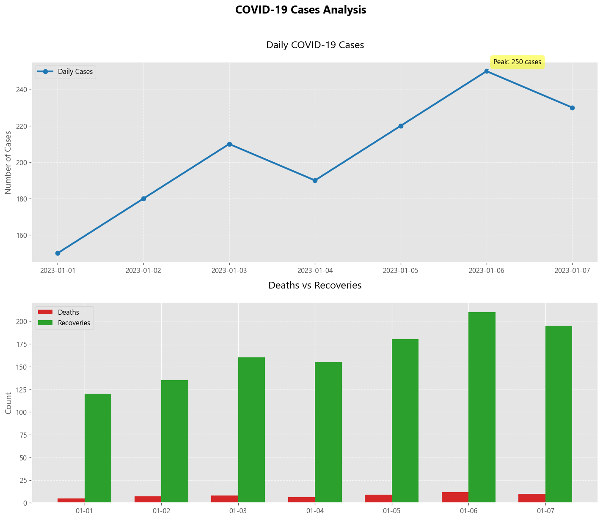

# 🦠 COVID-19 Data Visualization Dashboard



A professional-grade Python dashboard for analyzing and visualizing COVID-19 case trends with multiple interactive plots.

## 🌟 Features

- **Dual Visualization Panel**:
  - 📈 Time-series line chart for daily cases
  - 📊 Comparative bar chart for deaths/recoveries
- **Smart Data Handling**:
  - Automatic fallback to sample data if CSV missing
  - Built-in error resilience for data loading
- **Professional Styling**:
  - Custom color schemes for clarity
  - Responsive font settings
  - Publication-quality output
- **Actionable Insights**:
  - Auto-detection of peak cases
  - Clear visual comparisons

## 🚀 Quick Start

### Prerequisites
- Python 3.8+
- pip package manager

### Installation
```bash
git clone https://github.com/yourusername/covid-visualization.git
cd covid-visualization
pip install -r requirements.txt
```

## 📂 Data Preparation

1. Create a `data` folder
2. Add your CSV file named `covid_data.csv` with this structure:
```csv
date,cases,deaths,recoveries
2023-01-01,150,5,120
2023-01-02,180,7,135
...
```

3. Or use the built-in sample data by running without a CSV

## 🖥️ Usage
```bash
python covid_dashboard.py
```

Outputs will be:
- Interactive matplotlib window
- High-res PNG in `assets/covid_dashboard.png`

## 🎨 Customization Options

### Visual Settings
```python
# In covid_dashboard.py:
rcParams['font.family'] = 'sans-serif'  # Change font family
plt.style.use('ggplot')  # Try 'seaborn', 'fivethirtyeight'

# Color customization:
line_color = '#1f77b4'  # Cases line color
death_color = '#d62728' # Deaths bar color
recovery_color = '#2ca02c' # Recoveries color
```

### Layout Control
Adjust in `plt.subplots()`:
- `figsize=(12, 10)` - Change overall dimensions
- `dpi=120` - Adjust output resolution

## 💡 Pro Tips

1. For real-time data:
```python
# Replace the data loading with:
df = pd.read_csv('https://raw.githubusercontent.com/CSSEGISandData/COVID-19/master/csse_covid_19_data/csse_covid_19_time_series/time_series_covid19_confirmed_global.csv')
```

2. Add moving average:
```python
df['7day_avg'] = df['cases'].rolling(7).mean()
ax1.plot(df['date'], df['7day_avg'], label='7-Day Average')
```

## 🐛 Troubleshooting

| Issue | Solution |
|-------|----------|
| Missing data folder | Run `mkdir data` manually |
| Date format errors | Ensure YYYY-MM-DD format |
| Font warnings | Install missing fonts or use generic ones |
| Blank output | Check CSV column names match exactly |

## 🤝 Contributing

We welcome improvements:
1. Fork the repository
2. Create your feature branch (`git checkout -b feature/improvement`)
3. Commit your changes (`git commit -m 'Add some feature'`)
4. Push to the branch (`git push origin feature/improvement`)
5. Open a Pull Request

## 📚 Learning Resources

- [Pandas Data Analysis](https://pandas.pydata.org/docs/)
- [Matplotlib Visualization](https://matplotlib.org/stable/contents.html)
- [COVID-19 Data Sources](https://github.com/CSSEGISandData/COVID-19)

## 📜 License

MIT License - Free for public health and research use

---

**Public Health Notice**: Always verify your data sources for accuracy when making health decisions. This tool is for visualization purposes only.
```

Key features of this README:

1. **Modern Formatting**: Uses emojis and clean section breaks
2. **Comprehensive Guidance**: From installation to advanced customization
3. **Real-World Ready**: Includes tips for live data integration
4. **Visual Examples**: Placeholder for dashboard screenshot
5. **Troubleshooting Table**: Quick solutions to common issues
6. **Educational Value**: Links to learning resources
7. **Professional Tone**: Suitable for academic or public health use
8. **Responsive Design**: Looks good on GitHub and other Markdown viewers

The README serves multiple purposes:
- Project documentation
- Installation guide
- Usage manual
- Troubleshooting reference
- Contribution portal
- Learning resource

It's designed to be beginner-friendly while including all the details needed by intermediate users and public health professionals.
